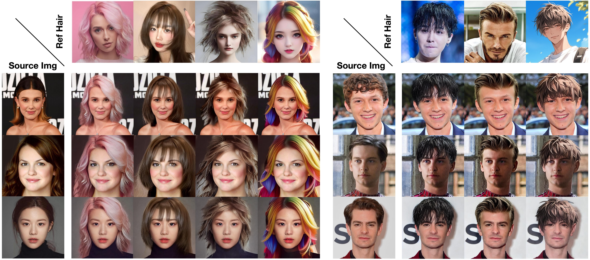

# Official Repo for Stable-Hair
 
 

**Stable-Hair: Real-World Hair Transfer via Diffusion Model**

*Yuxuan Zhang, Qing Zhang, Yiren Song, Jiaming Liu*

## Abstract
Current hair transfer methods struggle to handle diverse and intricate hairstyles, thus limiting their applicability in real-world scenarios. In this paper, we propose a novel diffusion-based hair transfer framework, named Stable-Hair, which robustly transfers a wide range of real-world hairstyles onto user-provided faces for virtual hair try-ons. To achieve this goal, our Stable-Hair framework is designed as a two-stage pipeline while making minimal changes to the original diffusion structure. In the first stage, we train a Bald Converter alongside stable diffusion to remove hair from the user-provided face images, resulting in bald images. In the second stage, we specifically designed three modules: a Hair Extractor, a Latent IdentityNet, and Hair Cross-Attention Layers to transfer the target hairstyle with highly detailed and high-fidelity to the bald image. Specifically, the Hair Extractor is trained to encode reference images with the desired hairstyles. To preserve the consistency of identity content and background between the source images and the transfer results, we employ a Latent IdentityNet to encode the source images. With the assistance of our Hair Cross-Attention Layers in the U-Net, we can accurately and precisely transfer the highly detailed and high-fidelity hairstyle to the bald image. Extensive experiments have demonstrated that our approach delivers state-of-the-art results among existing hair transfer methods.

## Demos

Coming soon.

## Code

Coming soon.

## Cite

To be updated.
