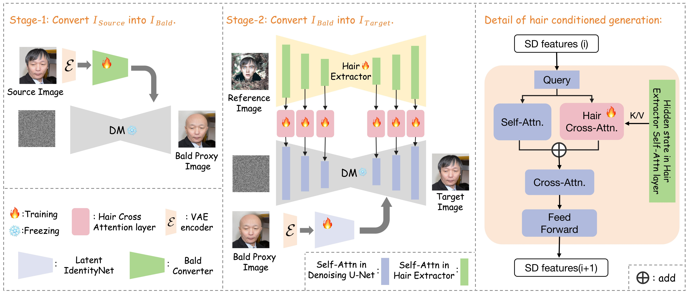

# Official Repo for Stable-Hair
<a href='https://xiaojiu-z.github.io/Stable-Hair.github.io/'></a> 
<a href='https://arxiv.org/pdf/2407.14078'></a> 

**Stable-Hair: Real-World Hair Transfer via Diffusion Model**

*[Yuxuan Zhang](https://scholar.google.com/citations?user=f2VoRWYAAAAJ&hl=en), Qing Zhang, [Yiren Song](https://scholar.google.com/citations?user=L2YS0jgAAAAJ&hl=en), [Jichao Zhang](https://zhangqianhui.github.io/), [Hao Tang](https://scholar.google.com/citations?user=9zJkeEMAAAAJ&hl=en), [Jiaming Liu](https://scholar.google.com/citations?user=SmL7oMQAAAAJ&hl=en)*


## Abstract
Current hair transfer methods struggle to handle diverse and intricate hairstyles, limiting their applicability in real-world scenarios. In this paper, we propose a novel diffusion-based hair transfer framework, named Stable-Hair, which robustly transfers a wide range of real-world hairstyles to user-provided faces for virtual hair try-on. To achieve this goal, our Stable-Hair framework is designed as a two-stage pipeline. In the first stage, we train a Bald Converter alongside stable diffusion to remove hair from the user-provided face images, resulting in bald images. In the second stage, we specifically designed a Hair Extractor and a Latent IdentityNet to transfer the target hairstyle with highly detailed and high-fidelity to the bald image. The Hair Extractor is trained to encode reference images with the desired hairstyles, while the Latent IdentityNet ensures consistency in identity and background. To minimize color deviations between source images and transfer results, we introduce a novel Latent ControlNet architecture, which functions as both the Bald Converter and Latent IdentityNet. After training on our curated triplet dataset, our method accurately transfers highly detailed and high-fidelity hairstyles to the source images. Extensive experiments demonstrate that our approach achieves state-of-the-art performance compared to existing hair transfer methods.


## Todo List
1. - [x] Stage1 inference code 
2. - [x] Stage1 pre-trained weights 
3. - [x] Stage2 inference code
4. - [x] Stage2 pre-trained weights
5. - [x] Training code

## Getting Started
### Environment Setup
Our code is built on the [diffusers](https://github.com/huggingface/diffusers/) version of Stable Diffusion, In our experiments, we use model version v1-5. If you have a diffusers version of [controlnet](https://huggingface.co/docs/diffusers/using-diffusers/controlnet) configured, you can use this repository directly.
```shell
git clone https://github.com/Xiaojiu-z/Stable-Hair.git
cd Stable-Hair
```

### Pretrained Models
[Google Drive](https://drive.google.com/drive/folders/1E-8Udfw8S8IorCWhBgS4FajIbqlrWRbQ?usp=drive_link). 
Download them and save to the directory `models/stage1` and `models/stage2`. 

### Inference
```python
python infer_full.py
```

### Gradio demo
We provide a simple gr demo for more flexible use.
```python
python gradio_demo_full.py
```
### Limitation
The Results are influenced by the effect of the first stage, if the bald converter does not go well, the effect of hair transfer is not good.
By the way, this released model only trained on a small dataset (6k images for stage1, 2w images for stage2) and all the face images are from FFHQ datasets which means they were cropped and aligned. From my practice, using video and full body datasets to finetune this model is a good way to improve, due to some restrictions the improved model will not be publicly available. If you want to expand the border of this model, feel free to contact me.

## Cite
```
@misc{zhang2024stablehairrealworldhairtransfer,
      title={Stable-Hair: Real-World Hair Transfer via Diffusion Model}, 
      author={Yuxuan Zhang and Qing Zhang and Yiren Song and Jiaming Liu},
      year={2024},
      eprint={2407.14078},
      archivePrefix={arXiv},
      primaryClass={cs.CV},
      url={https://arxiv.org/abs/2407.14078}, 
}
```
